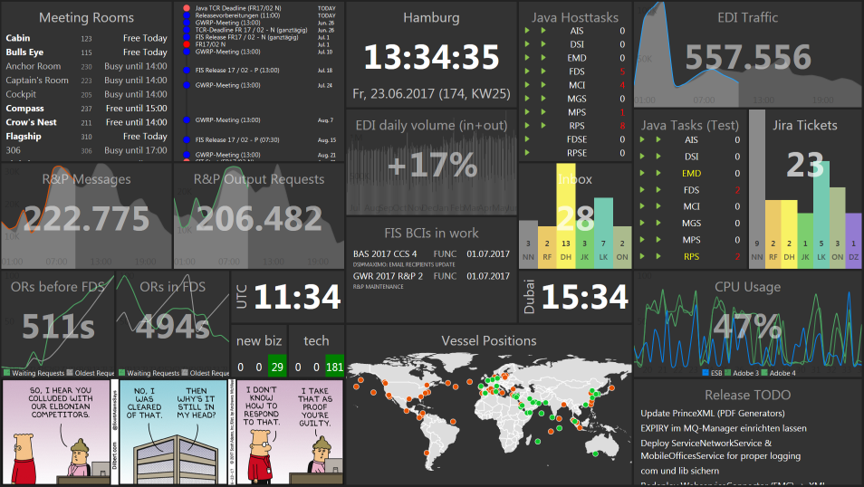

# Oversigt
Oversigt is a configurable dashboard software.  
It is able to serve several dashboards simultaneously and change the dashboards' configuration at runtime and without restarting the server.

``Oversigt`` is danish and means nothing else then *oversight*.

## How does it work?
Oversigt uses *event sources* to gather data from nearly any source of information. For each event source you can create several *widgets*. Each widget displays the information from its event source and is customizable how it displays the data. Those widgets will then be placed in *dashboards* which simply order the widgets and enable you to arrange the dashboard's content as you like.  
Then simply open a browser and violá:
 

## Where does it come from?
Oversigt is basically a Java port of [Dashing](https://github.com/Shopify/dashing). It is based on the great project of [jashing](https://github.com/avarabyeu/jashing).  
The advantage of Oversigt over the two projects is that it features a powerful server allowing just-in-time configuration. There is no need to edit configuration files any more :)

## How to start the dashboard?
You have two possibilities:
- Download a release and start the launcher.
- Include the dependency in your own project. The main class you need to call is: ``com.hlag.oversigt.core.Oversigt``

By default Oversigt will open a HTTP server listening at port 80 and 443. Open http://localhost/config to start configuring your dashboards.

## Features
Oversigt contains several built-in connectors able to connect to a variaty of sources of information:
* **Database** - Oversigt is able to connect to any JDBC supporting database and read data from it. Displaying this data can be done e.g. using a Rickshawgraph.
* **Exchange** - Connect to Microsoft Exchange mail boxes and display mail categories or Exchange tasks. Even the Exchange calendar can be accessed.
* **JIRA** - Display the results of any JIRA query
* **GIT** - Display data from or about your GIT repositories.
* **SSH** - Oversigt is able to connect to *nix mashines and perform any query using shell commands. Currently e.g. the CPU usage can be shown.
* **Text from Internet** - Connect to any server and download text to display. Is it JSON? Great, use JSONPath to extract the values you need!
* **Image from Internet** - You want your daily dilbert comic strip? Add it to you dashboard!
* Write your own event sources! Either commit to our project or simply add your event sources to the ``addons`` folder.
* Web based configuration
  * Configure 'event sources' gathering data from whereever you want.
  * Configure 'widgets' to form dashboards.
  * Customize your dashboard so every team can has exactly the dashboard it wants to have.

## History
We forked Jashing somewhen in 2016 and then extremely modified the configuration part of the project. Jashing as well as also Dashing itself are only able to serve dashboards configured by files existing on the server. Oversigt wants to create a dashboard software that can be configured by a simple web interface without needing to restart servers.  
One goal of the Oversigt software is to serve many dashboards from one single server while running only one instance of the server software. Every data should only be gathered once and then spread to all dashboards displaying this data while every dashboard should be able to customize its view of the data without interrupting others.
